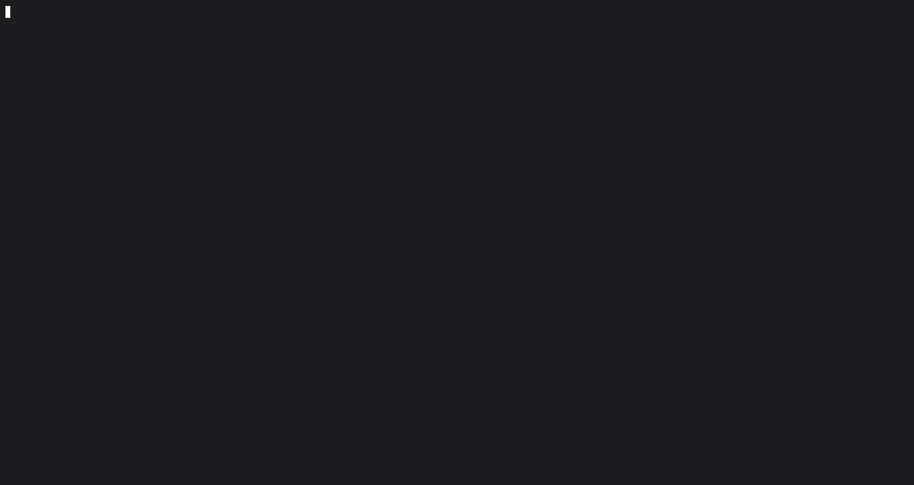

# R++ ( [26-06-24 - 9:13:14] )

TUI analog  linux roji with GAMBA and milfs

# Terminal RTS Game ( [26-06-24 - 9:13:14] )

Two countries battle for supremacy on a 500×500 map. A minimal real-time strategy game that runs entirely in your terminal with ncurses.



---

## English

### Overview

**REALLYFRONTHOLE** is a terminal-based RTS (Real-Time Strategy) game. You control one of two countries on a procedurally generated 500×500 tile map. Build units, conquer provinces, develop your economy, research upgrades, and destroy your opponent.

### Controls

| Key | Action |
|-----|--------|
| Arrows, WASD, ЦФЫВ, HJKL | Scroll the map |
| `1` / `2` / `3` | Select unit type (Ground / Naval / Air) |
| `B` | Build selected unit on the selected province |
| `A` | Toggle auto-attack mode |
| `M` | Move selected unit toward screen center |
| `Enter` | Select province at screen center |
| `D` | Develop selected province (costs 25G) |
| `R` | Research upgrade for selected unit (costs 40G) |
| `E` | Economy overview screen |
| `I` | Info / help screen |
| `:` | Command mode (see below) |
| `Space` | Pause / Resume |
| `Q` | Quit |

### Command Mode (`:`)

| Command | Effect |
|---------|--------|
| `:attack <type>` | Select unit type (ground, naval, air) |
| `:economy` | Show economy overview |
| `:help` | Show help screen with a random tip |

### Configuration

Edit `rts.cfg` in the project root to change:

- `primary_color` / `secondary_color` — UI colour scheme (red, green, yellow, blue, magenta, cyan, white, black)
- `update_rate` — game speed (1–60 ticks/second)
- `tip_1` … `tip_15` — random tips displayed by `:help`

### Project Structure

```
rts/
├── cfg/
│   └── config.cpp       — Configuration file loader
├── imp/
│   ├── main.cpp          — Entry point
│   ├── game.cpp          — Core game logic, combat, AI, economy
│   └── input.cpp         — Keyboard input & command mode
├── sqd/
│   ├── mapgen.cpp        — Procedural map generation
│   └── render.cpp        — Ncurses rendering & screens
├── lua/
│   ├── logger.lua        — Plugin: game action logger
│   ├── calculator.lua    — Plugin: simple calculator (like bc)
│   ├── translator.lua    — Plugin: EN→ES and EN→RU translator
│   ├── template.lua      — Plugin: development template
│   └── screenshot.lua    — Plugin: terminal screenshot capture
├── types.h               — Shared types, structs, constants
├── rts.cfg               — Game configuration file
├── Makefile              — Build system
└── readme.md             — This file
```

### Building

```bash
make          # build the game
make run      # build & run
make clean    # remove build artifacts
```

Requires: `g++`, `ncursesw` (`libncursesw5-dev` on Debian/Ubuntu).

### Lua Plugins

The `lua/` directory contains five example plugin scripts (Lua 5.1).
Some plugins require luarocks packages:

```bash
luarocks install luafilesystem   # for logger.lua
luarocks install lua-cjson       # for translator.lua
luarocks install lua-term        # for screenshot.lua
```

---

## Русский

### Обзор

**REALLYFRONTHOLE** — это RTS-игра в терминале. Вы управляете одной из двух стран на процедурно генерируемой карте 500×500. Стройте юниты, захватывайте провинции, развивайте экономику, проводите исследования и уничтожайте противника.

### Управление

| Клавиша | Действие |
|---------|----------|
| Стрелки, WASD, ЦФЫВ, HJKL | Прокрутка карты |
| `1` / `2` / `3` | Выбрать тип юнита (наземный / морской / воздушный) |
| `B` | Построить выбранный юнит на выбранной провинции |
| `A` | Режим авто-атаки |
| `M` | Переместить юнит к центру экрана |
| `Enter` | Выбрать провинцию в центре экрана |
| `D` | Развить провинцию (25G) |
| `R` | Исследовать улучшение для выбранного юнита (40G) |
| `E` | Экран экономики |
| `I` | Справка |
| `:` | Командный режим |
| `Space` | Пауза |
| `Q` | Выход |

### Командный режим (`:`)

| Команда | Эффект |
|---------|--------|
| `:attack <тип>` | Выбрать тип юнита (ground, naval, air) |
| `:economy` | Показать экономику |
| `:help` | Показать справку со случайным советом |

### Конфигурация

Файл `rts.cfg` в корне проекта:

- `primary_color` / `secondary_color` — цвета интерфейса
- `update_rate` — скорость игры (1–60 тиков/сек)
- `tip_1` … `tip_15` — советы, показываемые командой `:help`

### Структура проекта

```
rts/
├── cfg/config.cpp       — Загрузчик конфигурации
├── imp/                 — main.cpp, game.cpp, input.cpp
├── sqd/                 — mapgen.cpp, render.cpp
├── lua/                 — Примеры плагинов на Lua 5.1
├── types.h              — Типы, структуры, константы
├── rts.cfg              — Файл конфигурации
├── Makefile             — Сборка
└── readme.md            — Этот файл
```

### Сборка

```bash
make          # собрать игру
make run      # собрать и запустить
make clean    # очистить артефакты сборки
```

Требуется: `g++`, `ncursesw` (`libncursesw5-dev` на Debian/Ubuntu).

### Lua-плагины

В `lua/` находятся 5 примеров скриптов для Lua 5.1.
Некоторые требуют пакеты luarocks:

```bash
luarocks install luafilesystem   # для logger.lua
luarocks install lua-cjson       # для translator.lua
luarocks install lua-term        # для screenshot.lua
```

---

## Español

### Resumen

**REALLYFRONTHOLE** es un juego RTS basado en terminal. Controlas uno de dos países en un mapa generado proceduralmente de 500×500. Construye unidades, conquista provincias, desarrolla tu economía, investiga mejoras y destruye a tu oponente.

### Controles

| Tecla | Acción |
|-------|--------|
| Flechas, WASD, ЦФЫВ, HJKL | Desplazar mapa |
| `1` / `2` / `3` | Seleccionar tipo de unidad (Terrestre / Naval / Aérea) |
| `B` | Construir unidad en la provincia seleccionada |
| `A` | Alternar modo de ataque automático |
| `M` | Mover unidad hacia el centro de la pantalla |
| `Enter` | Seleccionar provincia en el centro |
| `D` | Desarrollar provincia (cuesta 25G) |
| `R` | Investigar mejora para la unidad seleccionada (cuesta 40G) |
| `E` | Pantalla de economía |
| `I` | Pantalla de ayuda |
| `:` | Modo de comandos |
| `Espacio` | Pausa / Reanudar |
| `Q` | Salir |

### Modo de comandos (`:`)

| Comando | Efecto |
|---------|--------|
| `:attack <tipo>` | Seleccionar tipo de unidad (ground, naval, air) |
| `:economy` | Mostrar resumen económico |
| `:help` | Mostrar ayuda con un consejo aleatorio |

### Configuración

Edite `rts.cfg` en la raíz del proyecto para cambiar:

- `primary_color` / `secondary_color` — colores de la interfaz (red, green, yellow, blue, magenta, cyan, white, black)
- `update_rate` — velocidad del juego (1–60 ticks/segundo)
- `tip_1` … `tip_15` — consejos mostrados por `:help`

### Estructura del proyecto

```
rts/
├── cfg/config.cpp       — Cargador de configuración
├── imp/                 — main.cpp, game.cpp, input.cpp
├── sqd/                 — mapgen.cpp, render.cpp
├── lua/                 — Ejemplos de plugins en Lua 5.1
├── types.h              — Tipos, estructuras, constantes
├── rts.cfg              — Archivo de configuración
├── Makefile             — Sistema de compilación
└── readme.md            — Este archivo
```

### Compilación

```bash
make          # compilar el juego
make run      # compilar y ejecutar
make clean    # limpiar artefactos
```

Requiere: `g++`, `ncursesw` (`libncursesw5-dev` en Debian/Ubuntu).

### Plugins Lua

El directorio `lua/` contiene 5 ejemplos de scripts para Lua 5.1.
Algunos requieren paquetes luarocks:

```bash
luarocks install luafilesystem   # para logger.lua
luarocks install lua-cjson       # para translator.lua
luarocks install lua-term        # para screenshot.lua
```

---

*Built with ncurses and Lua 5.1. / Сделано с ncurses и Lua 5.1. / Hecho con ncurses y Lua 5.1.*
